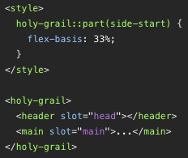
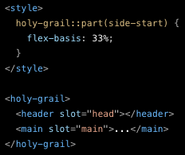

# storybook-docs-themes

[
 
](https://www.npmjs.com/package/storybook-docs-themes)

Set up theme colours of documentation previews in [Storybook] stories.

Original colours and colours according to the VS Code Dark+ theme:

 

## Usage via NPM

Install the stylesheets using `npm`:

    npm i -D storybook-docs-themes

Copy the stylesheets to the output directory in `.storybook/main.js`:

```js
module.exports = {
  staticDirs: [
    { from: '../node_modules/storybook-docs-themes/stylesheets', to: 'themes' }
  ]
}
```

Load the selected stylesheet to [Storybook] stories in `.storybook/preview-head.html`:

```html
<link rel="stylesheet" href="themes/vscode-dark-plus.min.css">
```

## Usage via CDN

Load the selected stylesheet to the stories in `.storybook/preview-head.html`:

```html
<link rel="stylesheet"
  href="https://unpkg.com/storybook-docs-themes@1.0.0/stylesheets/vscode-dark-plus.min.css">
```

## Themes

Stylesheets are located in the `stylesheets` directory of the distributed package.

### VS Code Dark+

Colours according to the VS Code theme "Dark+", enhanced to the WCAG AAA contrast.

    vscode-dark-plus.css
    vscode-dark-plus.min.css
    vscode-dark-plus.min.css.map

## Contributing

In lieu of a formal styleguide, take care to maintain the existing coding style.

## License

Copyright (C) 2023 Ferdinand Prantl

Licensed under the [MIT License].

[MIT License]: http://en.wikipedia.org/wiki/MIT_License
[Storybook]: https://storybook.js.org/
